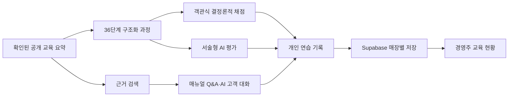

# GStep

> 공개 교육 자료에서 업무의 순서를 배우고, 가상 매장과 AI 고객을 통해 첫 근무를 연습하는 스토어 매니저 교육 앱

[라이브 데모](https://gs-hack-seven.vercel.app) · [GitHub 저장소](https://github.com/Hee1-99/gs-hack) · [교육 자료와 출처](https://gs-hack-seven.vercel.app/sources)

GStep은 처음 근무하는 스토어 매니저가 매뉴얼을 읽는 데서 끝나지 않고, 직접 판단하고 말해 본 뒤 피드백을 받을 수 있도록 만든 모바일 중심 웹 앱입니다. 로그인 없이도 핵심 연습을 체험할 수 있으며, 계정을 연결하면 경영주와 스토어 매니저가 같은 매장의 교육 기록과 체크리스트를 함께 관리할 수 있습니다.

GS25 공식 서비스가 아닙니다. 공개 교육 자료 중 본문을 확인한 58개 요약만 학습 근거로 사용하며, 상품·가격·거래·POS 화면은 모두 교육용 합성 데이터입니다.

## 해결하려는 문제

첫 근무자는 매뉴얼을 읽어도 실제 상황에서 무엇을 먼저 확인하고 어떻게 설명해야 하는지 연습하기 어렵습니다. 경영주 역시 교육 여부만이 아니라 어떤 업무를 어려워하는지, 어떤 질문이 반복되는지 한눈에 보기 어렵습니다.

GStep은 이 간극을 하나의 흐름으로 연결합니다.

1. **매뉴얼에서 배웁니다.** 확인된 공개 교육 요약을 6개 업무 영역, 36개 상황으로 재구성했습니다.
2. **가상 매장에서 행동합니다.** POS 확인, 상품 관리, 결제, 위생·안전, 고객 응대를 선택형·서술형으로 연습합니다.
3. **AI와 말해 봅니다.** 가상 고객과 최대 3회 대화하고 경청·공감, 사실 확인, 설명, 후속 대응을 기준으로 코칭을 받습니다.
4. **현장에서 이어갑니다.** 매장 Q&A와 날짜별 체크리스트로 근무 중 필요한 정보를 다시 확인합니다.
5. **매장이 함께 개선합니다.** 경영주는 소속 스토어 매니저의 연습·테스트·대화 점수, 질문, 체크리스트 완료 현황을 확인합니다.

## 핵심 기능

| 기능 | 사용자 경험 | 구현 기준 |
|---|---|---|
| 36단계 업무 연습 | 전체 과정 또는 6개 영역 중 하나를 선택하고 즉시 해설을 확인 | 객관식은 구조화된 정답으로 결정론적 채점 |
| 구인 테스트 | 별칭으로 응시하고 완료 전까지 정답·해설을 숨김 | 교육 참고용이며 자동 채용 판단에 사용하지 않음 |
| 서술형 AI 평가 | 5개 문항에서 매뉴얼 기준별 점수와 보완점을 제공 | 서버의 허용된 문항·루브릭만 사용하고 응답 구조·범위를 검증 |
| AI 고객 응대 | 행사 문의, 불만, 환불 상황에서 자연어로 대화 후 4항목 코칭 | 대화는 최대 3회 안에 자동 종료하며 실패 시 작성 내용 보존 |
| 매장 Q&A | 매뉴얼 근거 답변, 일반 조언, 매장 확인 필요 질문을 구분 | 근거가 없는 매장 정책은 만들어 내지 않음 |
| 날짜별 체크리스트 | 오늘과 이전 날짜의 상태를 분리해 저장·조회 | 스토어 매니저 개인 상태와 경영주 설정을 분리 |
| 경영주 페이지 | 소속 직원의 점수·질문·날짜별 완료 현황과 체크리스트를 관리 | 로그인·역할·매장 범위를 Supabase RLS로 강제 |

## GStep의 차별점

- **근거와 생성의 분리**: 매뉴얼 출처와 구조화된 업무 사실이 먼저이고, AI는 서술형 평가와 자연스러운 설명·대화에만 사용합니다.
- **정확도 중심 점수**: 정확도 90점과 시간 10점을 분리합니다. 기준을 충족한 답에만 시간 보너스를 주므로 빠른 오답이 유리하지 않습니다.
- **연습부터 매장 운영까지 한 흐름**: 개인 연습, 현장 Q&A, 날짜별 체크리스트, 경영주 교육 현황이 같은 계정·매장 범위에서 이어집니다.
- **외부 서비스가 없어도 체험 가능**: AI 데모 모드와 브라우저 로컬 저장을 제공해 API 키나 계정 연결 없이 핵심 흐름을 확인할 수 있습니다.
- **개인정보 최소화**: 구인 테스트는 실명 대신 별칭을 사용할 수 있고, 아이디 로그인은 내부 예약 주소로 변환되어 사용자에게 이메일을 요구하지 않습니다.

## 3분 데모 동선

1. [라이브 데모](https://gs-hack-seven.vercel.app)에서 **연습 시작하기**를 누릅니다.
2. `매장의 하루 전체` 또는 원하는 업무 영역을 선택해 가상 매장·POS 문제를 풉니다.
3. **AI 응대 연습**에서 고객 상황을 고르고 직접 답한 뒤 코칭 결과를 확인합니다.
4. **매장 Q&A**에서 추천 질문을 선택하고 답변의 출처 또는 일반 조언 표시를 확인합니다.
5. **오늘의 체크리스트**에서 상태를 저장하고 날짜를 바꿔 이전 기록을 확인합니다.
6. 계정 협업을 보려면 경영주 계정으로 매장을 만든 뒤 초대 코드로 스토어 매니저 계정을 연결합니다. 공개 데모 계정이나 실제 사용자 데이터는 제공하지 않습니다.

## 기술 구성

| 영역 | 기술 | 역할 |
|---|---|---|
| Web | Next.js 16 App Router, React 19, TypeScript | 반응형 UI, 서버 API, 접근성 있는 상태 전환 |
| AI | Google GenAI SDK | 서버 전용 서술형 채점, 매뉴얼 Q&A, 고객 대화·코칭 |
| Data/Auth | Supabase Auth, Postgres, RLS, RPC | 아이디 로그인, 매장·역할 연결, 기록과 설정의 권한 분리 |
| Validation | Zod, 구조화된 도메인 규칙 | AI 출력·점수 범위 검증과 안전한 폴백 |
| Quality | Vitest, Testing Library, Playwright | 단위·통합 및 1440×900/390×844 브라우저 회귀 검사 |
| Delivery | Vercel | Next.js 프로덕션 배포와 서버 전용 환경 변수 관리 |



## 로컬 실행

필수 환경은 Node.js 24입니다.

```powershell
git clone https://github.com/Hee1-99/gs-hack.git
Set-Location gs-hack
npm ci
Copy-Item .env.example .env.local
npm run dev
```

기본 `.env.example`은 `AI_DEMO_MODE=true`이므로 외부 AI나 Supabase 연결 없이도 체험할 수 있습니다. 계정·매장 기능을 연결하려면 [Supabase 설정 안내](supabase/README.md)에 따라 마이그레이션과 인증 설정을 먼저 적용합니다.

| 환경 변수 | 공개 여부 | 용도 |
|---|---|---|
| `GEMINI_API_KEY` | 서버 전용 | 실제 AI 채점·Q&A·고객 대화 |
| `GEMINI_MODEL` | 서버 전용 | 사용할 모델 이름 |
| `AI_DEMO_MODE` | 서버 전용 | `true`이면 외부 AI 호출 없이 반복 가능한 데모 응답 사용 |
| `NEXT_PUBLIC_SUPABASE_URL` | 공개 설정 | Supabase 프로젝트 URL |
| `NEXT_PUBLIC_SUPABASE_PUBLISHABLE_KEY` | 공개 설정 | 브라우저용 publishable 키 |

비밀 키에는 `NEXT_PUBLIC_` 접두사를 붙이지 않습니다. `.env.local`은 Git과 배포 업로드에서 제외합니다.

## 검증

반복 가능한 검증에서는 외부 AI와 실제 계정 저장소를 끕니다. PowerShell 환경 변수는 `.env.local`보다 우선합니다.

```powershell
$env:AI_DEMO_MODE='true'
$env:NEXT_PUBLIC_SUPABASE_URL=''
$env:NEXT_PUBLIC_SUPABASE_PUBLISHABLE_KEY=''
$env:NEXT_PUBLIC_SUPABASE_ANON_KEY=''
npm test
npm run typecheck
npm run build
npm run test:e2e
```

Playwright는 포트 3100의 프로덕션 서버를 데스크톱 1440×900과 모바일 390×844에서 검사하며 재시도는 사용하지 않습니다. 데이터베이스 권한은 [로컬 RLS 검증 절차](supabase/README.md#검증)로 별도 확인합니다. 로컬·실제 AI·실제 Supabase·배포 검증은 서로 다른 증거로 기록하며, 상세 결과는 [검증 매트릭스](docs/verification-matrix.md)와 [진행 기록](progress.md)에 있습니다.

## 데이터와 안전 경계

- 로그인하지 않은 기록은 해당 브라우저에만 저장되고, 로그인 후 클라우드 기록과 자동 병합하지 않습니다.
- 로그인한 사용자는 한 계정당 한 매장에 연결됩니다. 경영주는 자기 매장의 직원 기록만 보고, 스토어 매니저는 자기 기록만 수정할 수 있습니다.
- 초대 코드는 24시간 동안 한 번만 사용할 수 있으며 서버에는 해시만 저장합니다.
- 업로드 매뉴얼은 UTF-8 `.md`/`.txt`, 최대 20KB입니다. 브라우저에 보관하고 질문할 때 서버로 전달하며 PDF/HWP 추출은 지원하지 않습니다.
- 공개 교육 자료 78개 중 본문을 확인한 58개만 기본 검색 자료에 포함합니다. 미확보 20개 본문이나 최신 매장 정책을 AI가 추측해 채우지 않습니다.
- 점수는 학습 피드백입니다. 실제 POS 연동, 결제, 시험 부정행위 방지, 개인 감시, 자동 채용 결정 기능은 없습니다.

## 프로젝트 문서

- [PRODUCT.md](PRODUCT.md): 최신 제품 정의, 사용자 가치, 권한과 비목표
- [DESIGN.md](DESIGN.md): 시각 언어, 반응형·접근성 기준
- [교육 자료 맵](docs/gs25-store-manager-training-map.md): 공개 자료 조사와 수집 한계
- [콘텐츠 감사](docs/training-content-audit.md): 36단계 문항·근거 점검
- [Supabase README](supabase/README.md): 인증, 스키마, RLS, 실제 연결 절차

## 배포

프로덕션 빌드 출력은 `.firstday-build`이며 `vercel.json`의 `outputDirectory`와 일치합니다. 기존 Vercel 프로젝트에는 다음과 같이 배포합니다.

```powershell
vercel deploy --prod --build-env AI_DEMO_MODE=true --env AI_DEMO_MODE=false
```

Supabase 공개 설정은 Vercel의 빌드 환경에도 필요합니다. 실제 AI 키와 기타 비밀은 서버 환경 변수로만 설정하고 값은 문서·로그·Git에 남기지 않습니다.

## 현재 범위

현재 버전은 첫 근무 교육과 매장 단위의 연습 기록 공유에 집중합니다. 계정당 복수 매장, 매장 이동·탈퇴, 복수 경영주 위임, 이메일 비밀번호 복구, 최신 내부 매뉴얼 자동 동기화는 포함하지 않습니다. 자세한 제품 경계는 [PRODUCT.md](PRODUCT.md)를 참고하세요.
